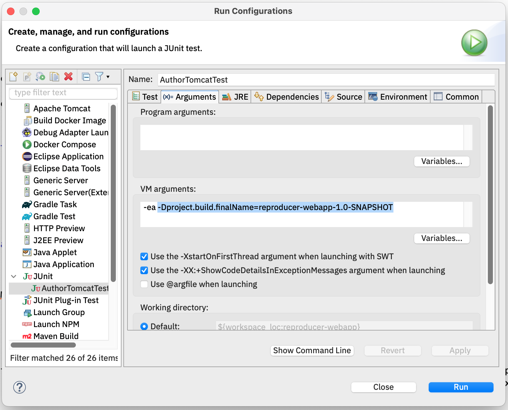

# magnolia-reproducer

Make Magnolia bugs reproducable for Magnolia support, with as little project code as possible

Generated from [Magnolia's project and module archetypes](https://docs.magnolia-cms.com/product-docs/6.3/developing/development-how-tos/how-to-use-magnolia-maven-archetypes/), with Magnolia Community Edition used in the POM, and then added a JUnit5 integration-test with [IBM iX' MagnoliaTomcatExtension](https://github.com/IBM/magkit-test/tree/main/magkit-test-server#using-the-junit5-extension).

That test is supposed to make Magnolia bugs reproducable for Magnolia support, with as little project code as possible.

Build results in a webapp that can be deployed e.g. to Tomcat.

## Building
From the top-level Maven project:

```
mvn package
```

This results in a WAR file + exploded WAR folder in `reproducer-webapp/target`.

In order to build a Docker OCI image with Tomcat to run the webapp, `cd` to `reproducer-webapp` and issue:

```
podman build --build-arg SOURCE_WAR_EXPLODED=target/reproducer-webapp-1.0-SNAPSHOT/ -t magnolia-reproducer .
```

## Running the webapp
### As Docker (OCI) image
To run the Docker image, issue:

```
podman run -it -p 8080:8080 magnolia-reproducer
```
This only runs the webapp as Docker/OCI image, without running any tests.

### As integration test in Maven
To run the `AuthorTomcatTest` as a Maven integration-test:

```
mvn verify
```
### As JUnit test in an IDE
[IBM iX' MagnoliaTomcatExtension](https://github.com/IBM/magkit-test/tree/main/magkit-test-server#using-the-junit5-extension) expects the name of the WAR to be passed in using the system property `project.build.finalName`. This is what the webapp's POM does in [./reproducer-webapp/pom.xml](./reproducer-webapp/pom.xml#L138), using the value of the Maven pre-defined variable.

#### In Eclipse
E.g. in Eclipse, this can be done by passing `-Dproject.build.finalName=reproducer-webapp-1.0-SNAPSHOT` as a VM argument:



#### In VSCode
In VSCode, add the following to your `settings.json`:

```
    "java.test.config": [
        {
            "name": "AuthorTomcatTestConfig",
            "workingDirectory": "${workspaceFolder}/reproducer-webapp",
            "vmArgs": [
                "-Dlog4j.config=WEB-INF/config/reproducer-log4j2.xml",  
                "-Dproject.build.finalName=reproducer-webapp-1.0-SNAPSHOT"
            ],
        }        
    ]
```    
